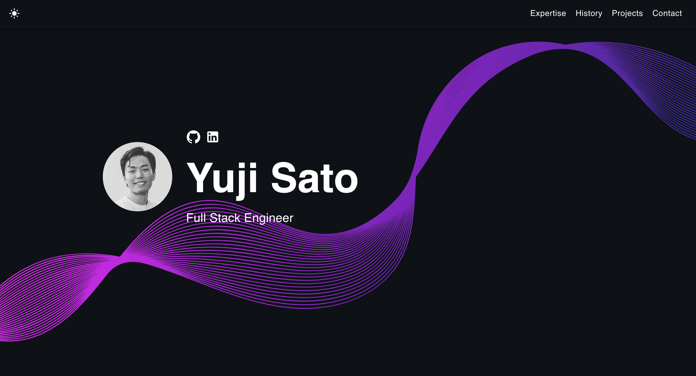

# Developer Portfolio Template 🚀

      

## What is this?

This simple portfolio template is designed to showcase your past projects, career history, skill sets, and more.

View the [Demo](https://yujisatojr.github.io/react-portfolio-template/).

**This template is free to use, and no attribution is required.** You can fork or download this repository to customize it for your own use. Please don't forget to leave a ⭐ if you like this portfolio!



## Features

✅ Open source (free to use, no attribution required)  
✅ Responsive design & mobile-friendly  
✅ Supports both dark and light modes  
✅ Highly customizable multi-component layout  
✅ Built with modern technologies (React, TypeScript, JavaScript, and SCSS)  

## Quick Setup

1. Ensure you have [Node.js](https://nodejs.org/) installed. Check your installation by running:

    ```bash
    node -v
    ```

2. In the project directory, install dependencies:

    ```bash
    npm install
    ```

3. Start the development server:

    ```bash
    npm start
    ```

4. Open [http://localhost:3000](http://localhost:3000) to view the app in the browser.

5. Customize the template by navigating to the `/src/components` directory. Modify texts, pictures, and other information as needed.

The page will reload if you make edits, and you will see any lint errors in the console.

If you are interested in creating a mockup image like the ones from the personal projects section, I recommend [Genmoo](https://gemoo.com/tools/browser-mockup-generator/). This website lets you generate sleek looking browser mockups for free.

## Deployment

You can choose your preferred service (e.g., [Netlify](https://www.netlify.com/), [Render](https://render.com/), [Heroku](https://www.heroku.com/)) for deployment. One of the easiest ways to host this portfolio is using GitHub Pages. Follow the instructions below for a production deploy.

1. **Set Up GitHub Repository**

    Create a new repository on GitHub for your portfolio app.

2. **Configure `package.json`**

    Edit the following properties in your `package.json` file:

    ```json
    {
        "homepage": "https://yourusername.github.io/your-repo-name",
        "scripts": {
            "predeploy": "npm run build",
            "deploy": "gh-pages -d build",
            ...
        }
    }
    ```

    Replace `yourusername` with your GitHub username and `your-repo-name` with the name of your GitHub repository.

3. **Deploy to GitHub Pages**

    Run the following command to deploy your app:

    ```bash
    npm run deploy
    ```

4. **Access Your Deployed App**

    After successfully deploying, you can access your app at `https://yourusername.github.io/your-repo-name`.